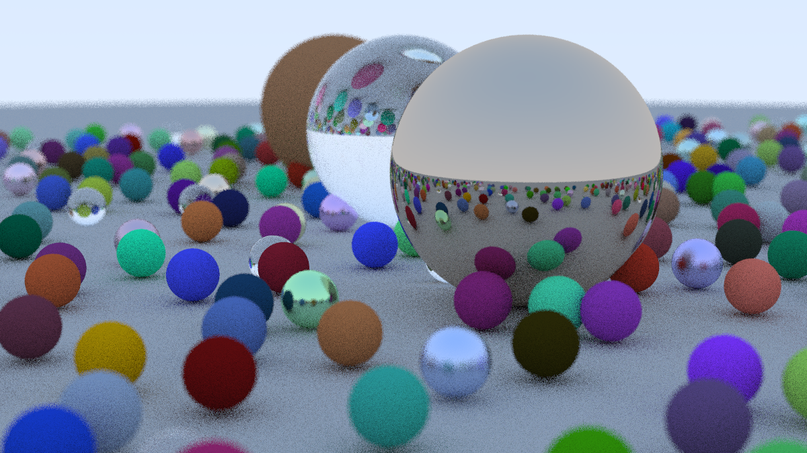

# Performance test: CPU vs GPU Ray Tracing

- Status: **OK**
- Notes: Tested and working as of 2020-12-12 (YYYY-MM-DD)

## What & Why

There is no code here, as all the code is actually borrowed from the (excellent) work of other people! 

The idea for this example comes from [this NVIDIA blog post](https://developer.nvidia.com/blog/accelerated-ray-tracing-cuda/). In the blog post, author Roger Allen takes you through the process of taking a simple [ray tracer](https://en.wikipedia.org/wiki/Ray_tracing_(graphics)), written in C++ for the CPU, and porting it over to CUDA on the GPU. 

Ray Allen's CUDA raytracer code is available [here](https://github.com/rogerallen/raytracinginoneweekendincuda), while the original CPU implementation by Peter Shirley is available [here](https://github.com/RayTracing/raytracing.github.io). 

All we do here is explain how to get this code set up and running on an Alibaba Cloud GPU ECS instance. It's a fun way to see the kind of performance boost you can get from the GPU!

## How

### Initial Setup

First, set up an Alibaba Cloud GPU instance. We tested our code on a g6nv instance with 8 vCPUs and 32 GB of RAM, plus a NVIDIA V100 GPU card. You can choose a different configuration if you prefer. 

Make sure that you check the box for "Auto-install GPU Driver" on the ECS configuration page (it should be right below the dropdown menu where you selected your operating system). 

You can configure the rest of the ECS instance settings however you like. However, you should make sure that:

- Your ECS instance has a way to access the Internet (we recommend attaching an EIP or checking the "Assign Public IP Address" box on the Networking configuration page). It will need this to fetch the GPU drivers and install them.
- You configure an SSH key or password for login.
- Your ECS instance's security group has Port 22 open (we'll need to use SSH and SFTP later).

After creating your instance, you should **wait 20-25 minutes** for the GPU drivers and CUDA to finish installing. The ECS will reboot once on its own at the end of the install process, so that the new GPU drivers can take effect. If you log in early you can watch the progress of the install script: just be sure to allow it to run to completion (you will eventually be disconnected when the instance reboots).

### Installing Additional Tools

Everything installed? Great! Take a look at the **public IP address** for your instance, which you can find from the **instances** list in the ECS console. All of the following commands will be carried out while logged into the instance. If you are a Linux or macOS user, you can simply use the `ssh` command which comes standard with the operating system. If you are using Windows, you can either [connect using Alibaba Cloud's VNC client](https://www.alibabacloud.com/help/doc-detail/163820.htm) or by [using PuTTY](https://www.chiark.greenend.org.uk/~sgtatham/putty/latest.html). If you are a *Windows* user, I would also recommend installing **PSFTP** alongside PuTTY, since it will come in handy later on when we download the image files our ray tracer generates. You can get it from the PuTTY link above. I won't go into detail here, you can learn how to use those tools from the PuTTY site or the (many) online tutorials that discuss its use. 

Have you logged into your ECS instance? Great! Now we can install a few extra tools which we'll need later:

```
apt update
apt get install screen git cmake
```

The `screen` command will give us a way to create multiple "virtual terminals" while we are logged in over SSH. This is a handy way to let long-running tasks continue in the background. We need `git` so we can fetch the source code for our ray tracer programs, and we'll use `cmake` to help us configure the build environment for some of that code.

### Fetching The Code

Everything installed? Good, now we just need to fetch some code from GitHub. First, the CPU (non-CUDA) code:

```
git clone https://github.com/RayTracing/raytracing.github.io.git
```

And then, then GPU (CUDA) code:

```
https://github.com/rogerallen/raytracinginoneweekendincuda
```

This should create two directories, one called `raytracinginoneweekendincuda` and another called `raytracing.github.io`. The first contains our GPU code, the second one contains our CPU code.

### Building And Running The (CPU) Code

Next, we need to build the code. Let's start with the CPU implementation:

```
cd raytracing.github.io
cmake -B build
cd build
make
```

Let's try running it to produce an output image in `.ppm` format. We'll time our run as well so we can compare its running time against the GPU implementation:

```
time build/inOneWeekend > image.ppm
```

### Building And Running The (GPU) Code

Ok, let's go back to the directory where we ran our `git clone` commands earlier. Now we run:

```
cd raytracinginoneweekendincuda
make rt
```

Next, we'll run the code:

```
make out.ppm
```

This will run the `rt` (ray tracer) program, produce an output image file called `out.ppm`, and return the total running time for the `rt` program. I find the output of that command a little bit hard to look at, when trying to compare timings, so you could also try running the `rt` command directly, like this:

```
time ./rt > out.ppm
```

This results in an output from the `time` command that is a little bit easier to make sense of. 

### Downloading The Images

Now that we've run our ray tracer code, we can download the `.ppm` files locally and have a look at them. You can do this with SFTP. If you are on macOS or Linux, simply use the built-in `sftp`. If you are on Windows, PuTTY's PSFTP is a good alternative. The login process is similar to that for SSH. If you are using `sftp` on the command line, you can use the `get` command from the `sftp` shell to fetch files, and `cd` and `ls` to move around the directory tree and list the contents of directories. We assume for the purposes of this tutorial that you already know how to use `sftp` (and the Linux/macOS command line!). 

You can find the files at `raytracinginoneweekendincuda/out.ppm` and `raytracing.github.io/build/image.ppm` respectively. In our tests, we got an output image like this one. Your should be similar:



### CPU vs GPU Performance

In our test run, the CPU code took 10 minutes and 55 seconds to run, while the GPU implementation took only 1 minute 17 seconds. That's a speedup of about 8.5x!

Note that we didn't really do very much tuning. By learning more about CUDA, we could have sped things up even more! 

If you are interested in programing for NVIDIA GPUs, the [CUDA documentation](https://docs.nvidia.com/cuda/) is a great resource. How fast can you make *your* ray tracer go? 

